# EasySignage — Planejamento de Atualização do Design

**Data:** julho de 2026  
**Objetivo:** aplicar o pacote em `design/` ao CMS em produção, alinhar todas as telas às diretrizes (`easysignage_diretrizes_interface_css.md`) e fechar as fases **UI-2** e **UI-3** do roadmap (§19.8).

---

## 1. Inventário da pasta `design/`

A pasta contém um **handoff parcial** pronto para copiar — não é o design system completo, mas a **fundação enterprise** + 2 telas de referência.

| Ficheiro | Estado | Função |
|----------|--------|--------|
| `GUIA-DE-ATUALIZACAO.md` | Documentação | Passos de aplicação, mapeamento FA→Lucide, checklist de inconsistências |
| `apps/cms/src/app/globals.css` | Pronto | Tokens corrigidos, sidebar escura, KPI/dashboard, badges com dot, CTA sólido |
| `apps/cms/src/components/app-shell.tsx` | Pronto | Shell com Lucide, nav em 3 secções, topbar com estado de rede |
| `apps/cms/src/app/(app)/dashboard/page.tsx` | Pronto (demo) | Dashboard visual com KPIs, donut, alertas, publicações, sites |
| `apps/cms/src/app/(app)/devices/page.tsx` | Pronto | Lista de dispositivos com badges, filtros, ícones Lucide |
| `apps/cms/src/lib/device-labels.ts` | Novo | Enums API → rótulos humanos (plataforma, estado, publicação) |
| `apps/cms/src/components/ui/StatusPill.tsx` | Novo | `StatusPill` + `ConnectionPill` com dot semântico |

### O que **não** está no pacote

| Item | Impacto |
|------|---------|
| `EasySignage Enterprise.dc.html` (referenciado no guia) | Protótipo navegável **ausente** no repositório — usar os TSX como referência visual |
| Caminho `entrega-design/` no guia | Nome desatualizado; ficheiros reais estão em `design/` |
| Login, Assets, Playlists, Sites, Scheduling, Groups, Monitoring, detalhes | Migração manual página a página |
| `<ConfirmDialog>` | Marcado como TODO no devices do pacote |
| Web Player | Tem `player.css` próprio; alinhado parcialmente às diretrizes |

---

## 2. Diagnóstico — CMS atual vs. pacote `design/`

### 2.1 Lacunas visuais críticas

| Área | Hoje (`apps/cms`) | Pacote `design/` |
|------|-------------------|------------------|
| **Dashboard** | Stub com placeholder e link | Painel operacional completo (dados demo) |
| **Sidebar** | Clara, lista plana, mistura EN/PT | Escura (#0B1220), secções Operação/Conteúdo/Sistema |
| **Ícones** | Font Awesome Solid (~35 ocorrências em 18 ficheiros) | Lucide outline (`strokeWidth={1.9}`) |
| **Paleta** | Fundo azulado (`#f8f9ff`), roxo `#712ae2` | Neutros `#EEF2F8`, roxo oficial `#7C3AED` |
| **CTAs operacionais** | `.btn--gradient` em 14+ locais | `.btn--primary` azul sólido; gradiente só `.btn--brand` |
| **Estados** | `StatusBadge` / `ConnectionBadge` (sem dot) | `StatusPill` / `ConnectionPill` com dot (§14, §19) |
| **Jargão** | `electron`, `provisioned` crus na UI | `device-labels.ts` com rótulos PT |
| **Idioma** | Mistura pt-PT / pt-BR / EN | Parcialmente normalizado no pacote |

### 2.2 O que já está bem no código atual

- **UI-0 concluída:** tokens, Inter, reset, utilitários em `globals.css`
- **UI-1 concluída:** shell com sidebar + topbar sob `(app)/layout.tsx`
- **Componentes existentes reutilizáveis:** `EmptyState`, `PublicationSyncBadge`, `ConnectionBadge`
- **Monitoring** (`/monitoring`): grelha NOC com preview JPEG — funcional; precisa alinhar tokens/ícones, não reescrever
- **Web Player:** tema escuro operacional coerente com NOC

### 2.3 Alinhamento com fases do roadmap (§19.8)

| Fase | Descrição | Após este plano |
|------|-----------|-----------------|
| **UI-0** Fundação visual | Tokens + base CSS | ✅ Mantida; **atualizar** tokens do pacote |
| **UI-1** Shell | Sidebar + topbar | ✅ Substituir `app-shell.tsx` |
| **UI-2** Componentes | Badges, tabelas, modais | 🔄 `StatusPill` + `ConfirmDialog` + consolidar badges |
| **UI-3** Migração telas Fase 1 | Dashboard, devices, filtros | 🔄 Dashboard + devices no pacote; resto gradual |
| **UI-4** Conteúdo Fase 2 | Assets, playlists | ⏳ Ícones + CTAs + filtros |
| **UI-5** Monitorização NOC | `/monitoring` escuro | ⏳ Tokens dark + Lucide |

---

## 3. Estratégia de execução

Princípio: **cascata primeiro, migração depois**.

1. Substituir `globals.css` e `app-shell.tsx` → **80% das telas melhoram sem tocar em cada ficheiro**
2. Introduzir componentes novos sem quebrar os antigos → migração incremental
3. Priorizar telas de **primeira impressão** (login, dashboard, devices)
4. Ligar dashboard à API real onde existir; degradar graciosamente onde não existir

```mermaid
flowchart LR
  subgraph fase1 [Fase 1 — Fundação]
    A[globals.css]
    B[app-shell + lucide]
  end
  subgraph fase2 [Fase 2 — Componentes]
    C[device-labels]
    D[StatusPill]
    E[ConfirmDialog]
    F[Consolidar badges]
  end
  subgraph fase3 [Fase 3 — Telas núcleo]
    G[Dashboard + API]
    H[Devices]
    I[Login]
  end
  subgraph fase4 [Fase 4 — Migração]
    J[Assets Playlists Sites]
    K[Scheduling Groups]
    L[Detalhes device/site/playlist]
  end
  subgraph fase5 [Fase 5 — Polimento]
    M[Monitoring NOC]
    N[pt-PT unificado]
    O[Higiene repo]
  end
  fase1 --> fase2 --> fase3 --> fase4 --> fase5
```



---

## 4. Plano por fases (detalhado)

### Fase 1 — Fundação visual (1–2 dias)

**Branch:** `feat/design-enterprise`

| Tarefa | Ação | Ficheiros |
|--------|------|-----------|
| 1.1 | `pnpm --filter @easysignage/cms add lucide-react` | `package.json` |
| 1.2 | Copiar `design/apps/cms/src/app/globals.css` → `apps/cms/...` | Substituir |
| 1.3 | Copiar `design/.../app-shell.tsx` → `apps/cms/...` | Substituir |
| 1.4 | Remover `@fortawesome/fontawesome-free` após migração de ícones críticos | `package.json`, `globals.css` |
| 1.5 | Validar: sidebar escura, topbar, login, uma página qualquer | Manual |

**Critério de aceite:** navegação funcional; sem regressão de layout; CTAs do shell usam Lucide.

**Risco:** páginas que usam classes removidas (ex. `.btn--gradient`) — manter alias temporário:

```css
/* Transição — remover na Fase 4 */
.btn--gradient { composes visual de .btn--primary ou .btn--brand conforme contexto }
```

Ou substituir globalmente `btn--gradient` → `btn--primary` nas páginas operacionais.

---

### Fase 2 — Biblioteca de componentes UI (2–3 dias)

| Tarefa | Ação |
|--------|------|
| 2.1 | Copiar `device-labels.ts` e `StatusPill.tsx` |
| 2.2 | Criar `ConfirmDialog.tsx` (substitui `window.confirm` — §13.6) |
| 2.3 | Unificar badges: `StatusPill` passa a ser o primitive; `StatusBadge` delega ou depreca |
| 2.4 | Manter `PublicationSyncBadge` — adaptar para usar `StatusPill` por baixo |
| 2.5 | Extrair `PageHeader` (título + lead + actions) — opcional mas reduz duplicação |

**Mapa de consolidação:**

| Antigo | Novo |
|--------|------|
| `StatusBadge` | `StatusPill` |
| `ConnectionBadge` | `ConnectionPill` |
| `PublicationSyncBadge` | Mantém API; render com `StatusPill` |
| Texto cru `device.platform` | `platformLabel()` |
| Texto cru `device.status` | `deviceState()` |

---

### Fase 3 — Telas núcleo (3–4 dias)

#### 3.1 Dashboard

Copiar `design/.../dashboard/page.tsx` e ligar à API:

| Bloco UI | Fonte de dados hoje | Implementação |
|----------|---------------------|---------------|
| KPIs (total, online, offline) | ✅ `GET /monitoring/overview` | Agregar `borderStatus` + contagem |
| Donut de estados | ✅ overview | Agrupar por `borderStatus` |
| Distribuição por site | ✅ overview | Agrupar por `site.name` |
| Gráfico uptime 24h | ❌ não existe | Manter demo ou ocultar até telemetria histórica |
| Alertas recentes | ❌ `/monitoring/alerts` não existe | Derivar de `borderStatus === 'fault'` ou lista vazia |
| Publicações recentes | ❌ endpoint global não existe | Usar publicações por device ou secção “Em breve” |

**Sugestão de adaptador** (`lib/dashboard-overview.ts`):

```ts
export function buildDashboardFromOverview(rows: OverviewRow[]) {
  // total, online, offline, fault → KPIs + donut + alertas + sites
}
```

Reutilizar tipos já definidos em `monitoring/page.tsx`.

#### 3.2 Dispositivos

Copiar `design/.../devices/page.tsx`:

- Integrar `ConfirmDialog` na exclusão
- Preservar filtro `status` da página atual (o pacote removeu — **reintroduzir**)
- Garantir compatibilidade com API `/devices` existente

#### 3.3 Login

Não está no pacote. Ajustes mínimos:

- Botão submit: `btn--brand` (gradiente permitido em onboarding)
- Ícone da marca: Lucide `LayoutGrid` ou logótipo
- Textos em **pt-PT** consistente

---

### Fase 4 — Migração gradual das demais telas (5–8 dias)

Ordem sugerida por impacto e tráfego operacional:

| Prioridade | Rota | Esforço | Principais mudanças |
|------------|------|---------|---------------------|
| P1 | `/assets` | M | Lucide, `btn--primary`, filtros áudio/texto já existentes |
| P1 | `/playlists`, `/playlists/[id]` | M | Ícones, badges, preview modal |
| P2 | `/sites`, `/sites/[id]`, `/sites/new` | M | CTAs, tabelas, ícones |
| P2 | `/devices/[id]` | L | Badges sync, labels humanos, ícones |
| P3 | `/scheduling` | L | Timeline + modais (5× FA hoje) |
| P3 | `/groups`, `/groups/[id]` | S | CTAs + ícones |
| P4 | `/campaigns`, `/alerts`, `/settings` | S | Stubs “Em breve” — só shell |

**Checklist por página:**

- [ ] Substituir todos `fa-solid` por Lucide (tabela §4 do `GUIA-DE-ATUALIZACAO.md`)
- [ ] CTAs de ação: `btn--primary` (não gradiente)
- [ ] Estados: `StatusPill` / `ConnectionPill`
- [ ] Enums: `device-labels.ts`
- [ ] Confirmações destrutivas: `ConfirmDialog`
- [ ] Empty states: componente `EmptyState` existente
- [ ] Revisar copy para pt-PT

**Contagem atual de Font Awesome:** ~35 referências em 18 ficheiros (grep `fa-solid`).

---

### Fase 5 — Monitorização e NOC (2 dias)

A página `/monitoring` já implementa grelha com preview — **não substituir pelo dashboard**.

| Tarefa | Ação |
|--------|------|
| 5.1 | Aplicar `[data-theme="dark"]` ou classe `.theme-noc` no layout de monitoring |
| 5.2 | Migrar ícones FA restantes para Lucide |
| 5.3 | Alinhar bordas/cores de `borderStatus` aos tokens `--color-success`, `--color-danger` |
| 5.4 | Link cruzado Dashboard ↔ Monitoring |

---

### Fase 6 — Web Player (1 dia, opcional)

O player (`apps/web-player`) já usa tokens escuros alinhados. Ações:

- Confirmar primário `#2563EB` e neutros após atualização do CMS
- Painel de configuração do player: trocar textos para pt-PT se necessário
- Sem Lucide no player (fullscreen, sem nav) — manter CSS puro

---

### Fase 7 — Higiene e documentação (1 dia)

Itens do `GUIA-DE-ATUALIZACAO.md` §7:

- Remover assets pesados soltos na raiz (se ainda existirem)
- Atualizar `docs/estado-desenvolvimento.md` — UI-2/UI-3
- Corrigir referência `entrega-design/` → `design/` no guia
- Adicionar protótipo HTML ao repo ou remover menção

---

## 5. Decisões de design a formalizar

| Tema | Decisão recomendada |
|------|---------------------|
| **Idioma** | **pt-PT** em todo o CMS (alinhado ao utilizador e copy existente em várias páginas) |
| **CTA primário** | Azul sólido `#2563EB` em dashboards, tabelas e formulários |
| **Gradiente** | Apenas login, onboarding e `.btn--brand` |
| **Ícones** | Lucide outline exclusivamente no CMS; nunca misturar com FA |
| **Sidebar** | Escura em todas as rotas `(app)`; conteúdo claro |
| **Badges** | Sempre com dot + texto (acessibilidade §19) |
| **Tema escuro** | Reservado a `/monitoring` e futuro NOC fullscreen |

---

## 6. Dependências técnicas

| Dependência | Estado |
|-------------|--------|
| `lucide-react` | A instalar |
| `GET /monitoring/overview` | ✅ Existe — base do dashboard real |
| `GET /monitoring/alerts` | ❌ Criar ou simular a partir do overview |
| `GET /publications?recent` | ❌ Criar endpoint agregado ou adiar secção |
| Telemetria histórica (uptime 24h) | ❌ Adiar gráfico ou manter placeholder |
| `ConfirmDialog` | ❌ Implementar na Fase 2 |

### Endpoint sugerido (API, opcional Fase 3+)

```
GET /monitoring/summary
→ { kpis, byBorderStatus, bySite, alerts[], recentPublications[] }
```

Evita lógica pesada no cliente e serve dashboard + futuras widgets.

---

## 7. Cronograma estimado

| Fase | Duração | Entregável |
|------|---------|------------|
| 1 — Fundação | 1–2 d | Shell enterprise + tokens globais |
| 2 — Componentes | 2–3 d | StatusPill, labels, ConfirmDialog |
| 3 — Núcleo | 3–4 d | Dashboard real + devices + login |
| 4 — Migração | 5–8 d | Todas as rotas `(app)` sem FA |
| 5 — NOC | 2 d | Monitoring alinhado tema escuro |
| 6 — Player | 1 d | Paridade visual mínima |
| 7 — Higiene | 1 d | Docs + limpeza |

**Total estimado:** 15–21 dias úteis (1 dev), ou **3–5 dias** para MVP visual (Fases 1–3 apenas).

---

## 8. Critérios de “pronto” (interface Fase 1 completa)

Conforme §19.8 do roadmap:

1. ✅ Tokens globais aplicados (pacote `globals.css`)
2. ✅ Shell sidebar escura + topbar com estado de rede
3. ⬜ Dashboard com dados reais (mínimo: KPIs + donut do overview)
4. ⬜ Devices com badges semânticos e rótulos humanos
5. ⬜ Zero Font Awesome no CMS
6. ⬜ CTAs operacionais sem gradiente
7. ⬜ `ConfirmDialog` em ações destrutivas
8. ⬜ Idioma pt-PT consistente
9. ⬜ Componentes UI-2 extraídos e reutilizados

---

## 9. Próximo passo imediato

Executar **Fase 1** em branch dedicada:

```bash
git checkout -b feat/design-enterprise
pnpm --filter @easysignage/cms add lucide-react
# Copiar os 2 ficheiros de fundação (globals.css + app-shell.tsx)
pnpm --filter @easysignage/cms dev
# Validar /dashboard, /devices, /login
```

Depois **Fase 2 + 3** com os 4 ficheiros restantes do pacote `design/`.

---

## 10. Referências

| Documento | Uso |
|-----------|-----|
| `design/GUIA-DE-ATUALIZACAO.md` | Handoff e mapeamento de ícones |
| `easysignage_diretrizes_interface_css.md` | Norma visual (tokens, §7 gradiente, §14 estados, §24 linguagem) |
| `digital_signage_arquitetura_roadmap.md` §19.8 | Fases UI-0 a UI-5 |
| `docs/estado-desenvolvimento.md` | Snapshot a atualizar após cada fase |
| `apps/cms/src/app/(app)/monitoring/page.tsx` | Tipos e padrões para ligar o dashboard à API |
