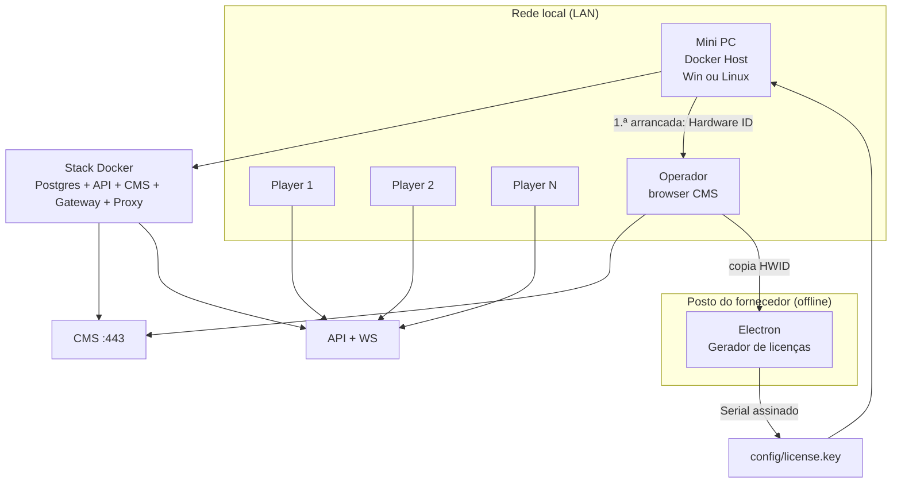
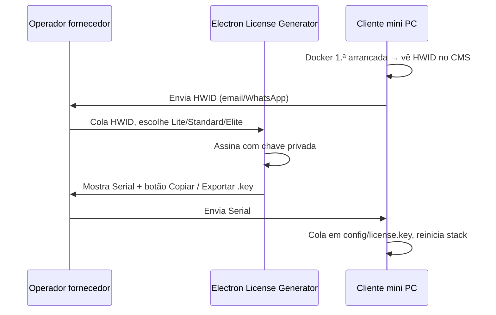

# Planejamento — Distribuição Docker e licenciamento EasySignage

Documento normativo para o **modelo comercial** do EasySignage: um **mini PC na rede local** corre um pacote Docker (servidor + CMS + serviços auxiliares); os **players** ligam-se à LAN; o **licenciamento** limita o número de dispositivos pareados conforme o plano (Lite / Standard / Elite).

Complementa `producao-e-auto-hospedagem.md` (deploy genérico) e `estado-desenvolvimento.md` (estado do código).

---

## 1. Visão geral do modelo



| Papel | Descrição |
|-------|-----------|
| **Mini PC (servidor)** | Host Docker; IP fixo ou hostname na LAN; armazena BD, uploads e licença. |
| **Stack Docker** | Todos os serviços backend num único `docker compose up`. |
| **Players** | Web-player, Electron ou Android — apenas clientes; não precisam de Docker. |
| **Gerador de licenças** | Aplicação Electron **do fornecedor**; não vai no mini PC do cliente. |

---

## 2. Pacote Docker — «EasySignage Server Box»

### 2.1 Objectivo

- **Um comando** (ou duplo-clique no Docker Desktop) sobe **toda** a plataforma.
- Funciona em **Windows** (Docker Desktop + WSL2) e **Linux** (Docker Engine + Compose v2).
- Pensado para **mini PC** (4–8 GB RAM, SSD 64 GB+, Ethernet).

### 2.2 Serviços no Compose (alvo)

| Serviço | Imagem / build | Porta interna | Exposição LAN |
|---------|----------------|---------------|---------------|
| `postgres` | `postgres:16-alpine` | 5432 | Não (só rede interna) |
| `api` | `easysignage/api` | 3001 | Via proxy |
| `cms` | `easysignage/cms` | 3000 | Via proxy |
| `realtime-gateway` | `easysignage/realtime-gateway` | 3020 | Via proxy (WS) |
| `reverse-proxy` | `caddy:2` ou `nginx:alpine` | 80, 443 | **Única entrada pública** |
| `hwid-agent` *(opcional)* | `easysignage/hwid-agent` | — | Gera/lê HWID do **host** |

**Volumes persistentes:**

```
./data/postgres/          # Base de dados
./data/uploads/           # STORAGE_ROOT da API
./config/license.key      # Licença (montado read-only na API)
./config/hardware.id      # Hardware ID estável (gerado no host)
./config/.env             # JWT_SECRET, domínio LAN, etc.
```

**Rede:** bridge `easysignage_internal`; apenas `reverse-proxy` publica portas no host.

### 2.3 Evolução face ao `docker-compose.yml` actual

O compose actual (Postgres + API + CMS) é a **base**. Falta acrescentar:

1. `realtime-gateway` (video wall sync).
2. `reverse-proxy` com TLS opcional (auto HTTPS LAN com hostname `.local` ou certificado manual).
3. Build args do CMS com `NEXT_PUBLIC_API_URL` apontando ao **hostname/IP do mini PC** (não `localhost`).
4. Perfil `production` com `SWAGGER=0`, passwords fortes e seed desactivado.
5. Imagem **publicada** (Docker Hub / GHCR) para o cliente não precisar de clonar o monorepo.

### 2.4 Distribuição ao cliente (artefactos)

| Artefacto | Conteúdo |
|-----------|----------|
| `easysignage-server-x.y.z.zip` | `docker-compose.yml`, `.env.example`, `config/`, scripts `install.ps1` + `install.sh`, manual PDF/MD |
| Imagens pré-build | `easysignage/api:x.y.z`, `cms`, `realtime-gateway`, `hwid-agent` |
| **Não incluir** | Código-fonte completo, chave privada de licenciamento, seed de demo em produção |

### 2.5 Docker Desktop vs Linux

| Aspecto | Windows (Docker Desktop) | Linux (Docker Engine) |
|---------|--------------------------|------------------------|
| Instalação | Docker Desktop + WSL2 | `apt install docker.io docker-compose-plugin` |
| Arranque | `install.ps1` ou Compose no Desktop | `install.sh` + systemd unit opcional |
| HWID | Script PowerShell no **host** grava `config/hardware.id` | Script bash no **host** |
| IP LAN | Definir IP estático no adaptador ou reserva DHCP | `netplan` / NetworkManager |
| Auto-start | «Start when Docker Desktop starts» + compose restart policy | `systemd` + `restart: unless-stopped` |

> **Importante:** o Hardware ID deve ser calculado **no sistema operativo host**, não dentro de um contentor aleatório (IDs de contentor mudam). Um utilitário nativo leve (`easysignage-hwid`) resolve isto em ambas as plataformas.

---

## 3. Hardware ID (HWID)

### 3.1 Requisitos

- **Estável** entre reinícios no mesmo mini PC.
- **Único** o suficiente para vincular licença (não precisa ser à prova de clonagem de VM).
- **Legível** na primeira arrancada (CMS + logs + ficheiro `config/hardware.id`).
- **Cross-platform** (Windows 10/11 e Linux amd64/arm64).

### 3.2 Fontes de entropia (host)

| Fonte | Windows | Linux |
|-------|---------|-------|
| Machine GUID | `HKLM\SOFTWARE\Microsoft\Cryptography\MachineGuid` | `/etc/machine-id` |
| Placa-mãe / produto | WMI `Win32_BaseBoard.Product` + `SerialNumber` | `/sys/class/dmi/id/board_serial` |
| Disco sistema | WMI `Win32_DiskDrive.SerialNumber` (1.º disco) | `/dev/disk/by-id/…` |
| MAC Ethernet | 1.ª interface física (excluir virtual) | `eno*` / `eth0` |

**Algoritmo:**

```
canonical = join("|", sorted(non_empty_sources))
hardwareId = "ES-" + base32(sha256(canonical)).slice(0, 26)   // ex.: ES-K7M2P9QX4R8W1N5H3J6L0T
```

### 3.3 Quando é gerado

1. **Instalação:** `install.sh` / `install.ps1` executa `easysignage-hwid` → grava `config/hardware.id`.
2. **Primeira subida do Docker:** API lê o ficheiro; se ausente, entra em modo **«não licenciado / trial»** e o CMS mostra banner com instruções.
3. **CMS → Definições → Licença:** exibe HWID com botão «Copiar» (mesmo valor do ficheiro).

### 3.4 Modo sem licença (trial)

Comportamento sugerido até inserir serial válido:

| Funcionalidade | Trial |
|----------------|-------|
| CMS login | Permitido (admin local) |
| Parear players | Máx. **1** (demo) |
| Campanhas / alertas | Bloqueados ou só leitura |
| RTSP / upload | Permitido com limite baixo |

*(Valores finais a fechar com produto.)*

---

## 4. Planos e limites de players

«Player» = **device pareado** com `deviceToken` activo (conta para o limite mesmo offline).

| Plano | Código interno | Máx. players | Funções |
|-------|----------------|--------------|---------|
| **Lite** | `LITE` | **2** | CMS, biblioteca, playlists, agendamento básico, layouts |
| **Standard** | `STD` | **20** | Lite + video walls, campanhas, alertas, RTSP |
| **Elite** | `ELITE` | **Ilimitado** (soft cap 999) | Standard + multi-site avançado *(futuro)* |

### 4.1 Enforcement na API

| Ponto | Regra |
|-------|--------|
| `POST /public/devices/pair` | Se `count(paired_devices) >= maxPlayers` → `403 LICENSE_PLAYER_LIMIT` |
| `POST /devices` (criar + código) | Idem |
| Heartbeat | Device já pareado continua; limite aplica-se a **novos** pareamentos |
| Downgrade de licença | Devices existentes acima do limite: «grandfather» até desparear manualmente, ou bloquear novos heartbeats dos excedentes *(decisão produto)* |

### 4.2 Estado na BD

Tabela `license_state` (singleton por instalação) ou ficheiro + cache em memória:

```prisma
model LicenseState {
  id            String   @id @default("default")
  hardwareId    String
  tier          String   // LITE | STD | ELITE
  maxPlayers    Int
  licenseKey    String   // serial completo (ou hash)
  issuedAt      DateTime
  expiresAt     DateTime? // opcional; null = perpétua
  lastValidated DateTime
}
```

---

## 5. Serial / License Key

### 5.1 Modelo criptográfico

- **Ed25519** (ou RSA-2048): par de chaves na **geração** (Electron fornecedor).
- **Chave pública** embutida na API (`LICENSE_PUBLIC_KEY` ou ficheiro `license-public.pem` na imagem).
- **Chave privada** só no **Electron Gerador de Licenças** (nunca no Docker do cliente).

### 5.2 Payload assinado (JSON → base64url)

```json
{
  "v": 1,
  "hwid": "ES-K7M2P9QX4R8W1N5H3J6L0T",
  "tier": "STD",
  "maxPlayers": 20,
  "issuedAt": "2026-07-10T00:00:00Z",
  "expiresAt": null,
  "customer": "Opcional — nome do cliente"
}
```

**Serial apresentado ao utilizador** (grupos de 4 para leitura):

```
ESGN-STD1-K7M2-P9QX-4R8W-<base64url_signature_truncada>
```

Ou formato de **uma linha** em `config/license.key` (ficheiro texto).

### 5.3 Validação no arranque (API)

```
1. Ler config/license.key (ou env EASYSIGNAGE_LICENSE_KEY)
2. Decodificar payload + verificar assinatura Ed25519
3. Comparar payload.hwid com config/hardware.id
4. Verificar expiresAt (se definido)
5. Persistir LicenseState; expor GET /license/status (CMS autenticado)
6. Se inválido → modo trial + log + banner CMS
```

### 5.4 Rotação e suporte

- **Renovação:** novo serial com mesma `hwid` substitui o anterior.
- **Mudança de hardware:** cliente contacta suporte; fornecedor gera serial para novo HWID (processo manual anti-fraude).
- **Revogação:** lista de revogação opcional (fase 2; requer telemetria ou update de chaves).

---

## 6. Aplicação Electron — Gerador de licenças

### 6.1 Posicionamento

| App | Onde corre | Quem usa |
|-----|------------|----------|
| `apps/electron-player` | PCs dos ecrãs | Cliente final |
| **`apps/license-generator`** *(novo)* | PC do **fornecedor/distribuidor** | Equipa comercial / suporte |

**Não** confundir: o gerador **não** instala no mini PC.

### 6.2 Fluxo da UI



### 6.3 Ecrãs

1. **Entrada:** campo HWID (validação formato `ES-…`), selector de plano, validade opcional, nome do cliente.
2. **Saída:** serial, QR code opcional, «Guardar como license.key».
3. **Histórico local** *(opcional)*: SQLite cifrado com registos emitidos (auditoria).
4. **Definições:** carregar chave privada (ficheiro `.pem` protegido por password do SO).

### 6.4 Stack técnica

- Electron + React (alinhado ao monorepo).
- Pacote `@easysignage/license-core` em `packages/`:
  - `generateLicense(payload, privateKey)`
  - `verifyLicense(serial, publicKey)` — partilhado com API (mesma lógica).
- Build: `electron-builder` → `.exe` (Windows) + `.AppImage` (Linux) para a equipa do fornecedor.

### 6.5 Segurança operacional

- Chave privada em cofre (1Password, HSM) — export pontual para máquina do gerador.
- MFA ou password master na app antes de assinar.
- Logs de emissão sem chave privada.

---

## 7. Integração CMS e primeira arrancada

### 7.1 Banner «Primeira configuração»

Quando `licenseState.tier === 'TRIAL'` ou HWID sem licença:

- Página `/setup` ou modal no login:
  1. «O seu Hardware ID: **ES-…**» [Copiar]
  2. «Insira o serial em Definições → Licença ou em `config/license.key`»
  3. Link para manual (PDF/MD)

### 7.2 Página Definições → Licença

| Campo | Descrição |
|-------|-----------|
| Hardware ID | Só leitura |
| Plano actual | Lite / Standard / Elite / Trial |
| Players | `3 / 20` utilizados |
| Validade | Data ou «Perpétua» |
| Serial | Textarea + «Aplicar» (escreve ficheiro via API ou pede reinício) |

### 7.3 API — endpoints novos

| Método | Rota | Descrição |
|--------|------|-----------|
| `GET` | `/license/status` | HWID, tier, maxPlayers, usedPlayers, expiresAt, valid |
| `POST` | `/license/apply` | Body `{ licenseKey }` — valida e persiste *(admin only)* |
| `GET` | `/license/public-key` | Só em dev; em prod a chave vai na imagem |

---

## 8. Manual de instalação (estrutura)

Documento alvo: **`docs/manual-instalacao-mini-pc.md`** (cliente final).

### Capítulos

1. **Requisitos** — mini PC, RAM, disco, rede, portas 80/443.
2. **Windows** — instalar Docker Desktop, WSL2, partilha de disco para `data/`.
3. **Linux** — Docker Engine, utilizador no grupo `docker`, firewall `ufw`.
4. **Instalação** — descompactar ZIP, `install.ps1` / `install.sh`, `.env` (password BD, JWT).
5. **Primeira arrancada** — `docker compose up -d`, abrir `https://easysignage.local` ou `http://IP:PORT`.
6. **Obter Hardware ID** — CMS setup / ficheiro `config/hardware.id`.
7. **Activar licença** — receber serial, colar em `config/license.key`, `docker compose restart api`.
8. **Parear players** — URL do player `http://IP:3010` ou app Electron; código no CMS.
9. **Backup** — volumes `data/postgres` e `data/uploads`.
10. **Resolução de problemas** — logs `docker compose logs`, health, firewall.

Anexo: cartão rápido «1 página» para colar no mini PC.

---

## 9. Estrutura no monorepo (alvo)

```
EasySignage/
├── docker/
│   ├── api.Dockerfile
│   ├── cms.Dockerfile
│   ├── realtime-gateway.Dockerfile
│   ├── caddy.Caddyfile
│   └── entrypoint-api.sh
├── deploy/
│   ├── server-box/                 # Pacote cliente
│   │   ├── docker-compose.yml
│   │   ├── .env.example
│   │   ├── install.ps1
│   │   ├── install.sh
│   │   └── config/
│   │       ├── hardware.id.example
│   │       └── license.key.example
│   └── hwid/
│       ├── easysignage-hwid/       # CLI Go ou Rust (Win+Linux)
│       └── README.md
├── apps/
│   ├── license-generator/          # Electron — gerador (fornecedor)
│   │   ├── src/main/
│   │   └── src/renderer/
│   └── api/src/license/            # Módulo Nest: validação + limites
├── packages/
│   └── license-core/               # sign/verify + tipos partilhados
└── docs/
    ├── manual-instalacao-mini-pc.md
    └── planejamento-distribuicao-licenciamento.md  # este ficheiro
```

---

## 10. Roadmap de implementação

| Fase | Entrega | Dependências |
|------|---------|--------------|
| **D1** | `packages/license-core` + testes unitários sign/verify | — |
| **D2** | CLI `easysignage-hwid` (Win/Linux) + scripts `install.*` | D1 parcial |
| **D3** | Módulo `license` na API + `LicenseState` + enforcement no `pair` | D1 |
| **D4** | Compose «Server Box» completo (proxy, gateway, volumes, imagens GHCR) | docker actual |
| **D5** | CMS `/setup` + Definições → Licença | D3 |
| **D6** | `apps/license-generator` (Electron) MVP | D1 |
| **D7** | `docs/manual-instalacao-mini-pc.md` + vídeo curto | D4–D6 | **Feito** (manual; vídeo pendente) |
| **D8** | CI: build imagens + zip `server-box` por tag Git | D4 | **Feito** (workflow + script ZIP; GHCR após tag `v*`) |

**Ordem recomendada:** D1 → D3 → D2 → D4 → D5 → D6 → D7 → D8.

Estimativa grossa: **4–6 semanas** com 1 dev full-stack (paralelizável D6 com D4).

---

## 11. Riscos e decisões em aberto

| Tema | Opções | Recomendação |
|------|--------|--------------|
| HWID em VM | ID instável | Documentar «bare metal ou mini PC dedicado»; VM não suportada oficialmente |
| Lite sem video wall | Produto | Confirmar tabela de features por tier |
| Expiração | Subscrição vs perpétua | Campo `expiresAt` já previsto; política comercial à parte |
| Multi-tenant no mini PC | 1 tenant vs N | **1 instalação = 1 tenant** no modelo mini PC (simples) |
| Players Electron licenciados | Contam no limite? | **Sim** — mesmo `device` na API |
| Offline eterno | Sem phone-home | Licença 100 % offline; revogação só com update manual |

---

## 12. Checklist de aceitação (QA)

- [ ] `docker compose up` em Windows 11 + Docker Desktop sobe todos os serviços.
- [ ] Idem em Ubuntu 22.04 LTS.
- [ ] HWID igual após reboot no mesmo hardware.
- [ ] HWID diferente entre dois mini PCs.
- [ ] Sem licença: máximo 1 player (trial).
- [ ] Serial Lite: bloqueia 3.º pareamento.
- [ ] Serial Standard: permite 20, bloqueia 21.º.
- [ ] Serial Elite: permite >20.
- [ ] Serial com HWID errado: rejeitado.
- [ ] Gerador Electron produz serial aceite pela API.
- [ ] CMS mostra contagem `N / max` players.
- [ ] Manual seguido por utilizador não técnico em < 30 min.

---

## 13. Referências internas

| Documento | Relação |
|-----------|---------|
| `docker-compose.yml` | Base actual (3 serviços) |
| `docker/README.md` | Build API/CMS |
| `docs/producao-e-auto-hospedagem.md` | Deploy genérico / VPS |
| `apps/electron-player` | Player em campo (não gerador) |
| `apps/api/src/devices/devices.service.ts` | Ponto de enforcement `pair` |

---

*Documento de planeamento — julho 2026. Implementação conforme roadmap §D1–D8.*
