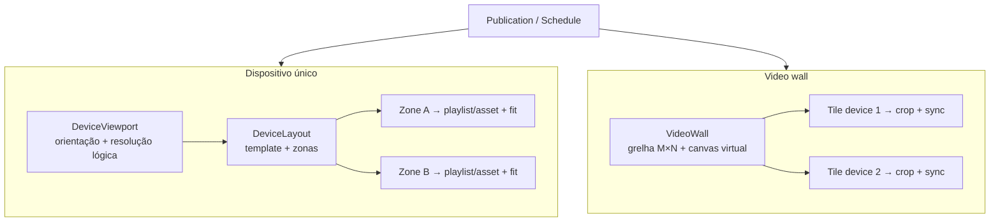

# EasySignage — Planejamento: orientação, resolução, zonas e video wall

**Data:** julho de 2026  
**Objetivo:** integrar ao roadmap as capacidades de **viewport por dispositivo**, **layouts multi-zona**, **modos de exibição de conteúdo** e **paredes de ecrãs sincronizadas**, sem quebrar o fluxo atual de `current_item_json`, publicações, agenda e `contentRevision`.

**Documentos relacionados:** `digital_signage_arquitetura_roadmap.md` (§8.7 `screens`, §19), `docs/estado-desenvolvimento.md`, `packages/device-protocol`, `packages/shared-types`.

---

## 1. Resumo executivo

| Capacidade | Descrição | Prioridade sugerida |
|------------|-----------|---------------------|
| **A — Viewport do dispositivo** | Orientação (retrato/paisagem/virado) + resolução lógica de desenho | Alta (fundação) |
| **B — Layouts e zonas** | Subdivisão do ecrã; playlist/asset distinto por zona; templates pré-definidos | Alta |
| **C — Fit de conteúdo** | Nativo, conter, cobrir, esticar, centralizar; resolução alvo por zona/fonte | Média |
| **D — Video wall** | Vários dispositivos como grelha sincronizada; um conteúdo “virtual” partido em tiles | Média–baixa (complexidade) |

**Princípio de integração:** evoluir o modelo em camadas — primeiro **viewport** (1 zona implícita), depois **layout multi-zona** (N zonas no mesmo device), por fim **video wall** (N devices, 1 canvas virtual). Cada camada reutiliza os mesmos enums (`Orientation`, `FitMode`) e o mesmo motor de `contentRevision`.

---

## 2. Estado atual (baseline jul/2026)

### O que já existe

| Área | Hoje |
|------|------|
| **Device** | Cadastro, pareamento, `wakeMac`, plataforma; **sem** orientação/resolução no schema Prisma |
| **Conteúdo ativo** | `device_state.current_item_json`: `{ type: "asset" \| "playlist", … }` — **uma** fonte full-screen |
| **Publicação** | `Publication.payload_json` espelha o mesmo formato simples |
| **Agenda** | `ScheduleEngineService` troca `current_item_json` por playlist agendada |
| **Player** | Um único stage (`SlideLayer`); sem rotação nem zonas |
| **Roadmap §8.7** | Tabela `screens` **planejada** (resolution, orientation) — **não implementada** |
| **Grupos** | `DeviceGroup` = agrupamento lógico para publicação/agenda — **não** sincronização espacial |

### Lacunas face aos requisitos

1. Impossível definir retrato vs. paisagem no CMS ou no player.
2. Impossível dividir o ecrã em zonas com conteúdos independentes.
3. Impossível escolher como o media preenche a zona (stretch vs. letterbox).
4. Impossível montar parede 2×2, 3×1, etc., com reprodução sincronizada.

---

## 3. Modelo conceitual unificado

### 3.1 Hierarquia



### 3.2 Regra de precedência no player

1. Se o device pertence a uma **video wall ativa** → modo tile (crop + sync de grupo).
2. Senão, se `current_item_json.type === "layout"` → render multi-zona.
3. Senão, modo legado **full-screen** (`asset` / `playlist`) — compatibilidade total.

### 3.3 Evolução de `current_item_json` (retrocompatível)

**Legado (mantido):**
```json
{ "type": "playlist", "playlistId": "uuid" }
```

**Layout multi-zona (novo):**
```json
{
  "type": "layout",
  "layoutId": "uuid",
  "revision": "abc123",
  "viewport": {
    "width": 1080,
    "height": 1920,
    "orientation": "portrait"
  },
  "zones": [
    {
      "zoneId": "main",
      "frame": { "x": 0, "y": 0, "w": 100, "h": 70, "unit": "percent" },
      "source": { "type": "playlist", "playlistId": "uuid" },
      "display": { "fit": "cover", "align": "center" }
    },
    {
      "zoneId": "ticker",
      "frame": { "x": 0, "y": 70, "w": 100, "h": 30, "unit": "percent" },
      "source": { "type": "playlist", "playlistId": "uuid2" },
      "display": { "fit": "contain", "background": "#000" }
    }
  ]
}
```

**Tile de video wall (novo):**
```json
{
  "type": "wall_tile",
  "wallId": "uuid",
  "wallRevision": "rev-xyz",
  "tile": { "row": 0, "col": 1, "rows": 2, "cols": 2 },
  "viewport": { "width": 1920, "height": 1080, "orientation": "landscape" },
  "virtualCanvas": { "width": 3840, "height": 2160 },
  "crop": { "x": 1920, "y": 0, "w": 1920, "h": 1080 },
  "source": { "type": "playlist", "playlistId": "uuid" },
  "sync": {
    "groupId": "wall-uuid",
    "epochMs": 1730000000000,
    "toleranceMs": 80
  }
}
```

O `contentRevision` (hash em `content-revision.ts`) deve passar a incluir: `layoutId`, `wallRevision`, frames das zonas e `fit` — para invalidar cache do player quando qualquer parâmetro mudar.

---

## 4. Domínio de dados (Prisma) — proposta

### 4.1 Enums partilhados (`packages/shared-types`)

```ts
// Orientação física do viewport (CSS transform no player)
type DisplayOrientation =
  | 'landscape'           // 0°
  | 'portrait'            // 90° CW (ou canvas alto)
  | 'landscape_flipped'   // 180°
  | 'portrait_flipped';   // 270°

type ContentFitMode =
  | 'native'    // 1:1 px, sem escala
  | 'contain'   // letterbox, mantém aspecto
  | 'cover'     // preenche zona, pode cortar
  | 'stretch'   // distorce para preencher
  | 'center';   // native centrado, sem upscale
```

### 4.2 Tabelas novas / alterações

| Modelo | Função |
|--------|--------|
| **`Device` (alteração)** | `viewportWidth`, `viewportHeight`, `orientation`, `safeAreaJson?` (overscan) |
| **`LayoutTemplate`** | Catálogo sistema + custom tenant: `slug`, `name`, `zonesJson` (frames %), `previewSvg?` |
| **`DeviceLayout`** | Instância ativa no device: `deviceId`, `templateId`, `name`, `zonesJson` (frames + bindings) |
| **`ZoneBinding`** | Opcional normalizado: `layoutId`, `zoneKey`, `playlistId?`, `assetId?`, `fit`, `targetWidth?`, `targetHeight?` |
| **`VideoWall`** | `name`, `siteId`, `gridRows`, `gridCols`, `virtualWidth`, `virtualHeight`, `orientation`, `status` |
| **`VideoWallTile`** | `wallId`, `deviceId`, `row`, `col`, `cropJson` |
| **`VideoWallPublication`** | Snapshot versionado (espelha `Publication` mas ao nível da wall) |

**Nota:** na **Fase B** pode bastar `DeviceLayout.zonesJson` (JSON documentado) sem normalizar `ZoneBinding` — alinha com o padrão atual de `current_item_json` e `payload_json`.

### 4.3 Templates pré-definidos (seed)

| Slug | Zonas | Uso típico |
|------|-------|------------|
| `fullscreen` | 1 (100%) | Comportamento atual |
| `split_h_2` | 50% + 50% horizontal | Menu + promo |
| `split_v_2` | 50% + 50% vertical | Duas colunas retrato |
| `l_shape` | 70% main + 30% lateral | Hero + ticker |
| `grid_2x2` | 4 iguais | Quadros independentes |
| `pip_br` | 85% + 15% canto | Principal + inset |
| `header_body` | 15% topo + 85% corpo | Faixa + conteúdo |

O CMS apresenta **galeria visual** (SVG/thumbnail) antes do editor fino.

---

## 5. API e protocolo device

### 5.1 Endpoints CMS (JWT)

| Método | Rota | Descrição |
|--------|------|-----------|
| `GET` | `/layout-templates` | Lista templates (sistema + tenant) |
| `POST` | `/devices/:id/layout` | Cria/atualiza layout e bindings |
| `GET` | `/devices/:id/layout` | Layout ativo + preview metadata |
| `PATCH` | `/devices/:id/viewport` | Orientação + resolução lógica |
| `POST` | `/video-walls` | CRUD walls |
| `POST` | `/video-walls/:id/tiles` | Mapear devices → posições |
| `POST` | `/video-walls/:id/publish` | Publicação sincronizada da wall |
| `POST` | `/video-walls/:id/sync` | Forçar re-sync (epoch novo) |

`PATCH /devices/:id/test-content` e `POST /devices/:id/publish` passam a aceitar:

```ts
{ layoutId?: string }           // preferido em multi-zona
| { assetId?: string }          // legado
| { playlistId?: string }       // legado
| { videoWallId?: string }      // ativa modo tile nos membros
```

### 5.2 Device API (Bearer)

| Alteração | Detalhe |
|-----------|---------|
| `GET /device/state` | Inclui `viewport`, `layout` resumido, `wallTile?`, `syncEpoch?` |
| `GET /device/layout` | Manifest completo de zonas + fontes (opcional, evita payload grande no poll) |
| `POST /device/heartbeat` | Aceita `playbackSync` por zona: `{ zoneId, itemIndex, positionMs, driftMs }` |
| `GET /device/walls/:id/sync` | Epoch + tolerância para alinhar arranque |

### 5.3 `device-protocol` (pacote partilhado)

Adicionar tipos versionados `LayoutManifest`, `WallTileManifest`, `PlaybackSyncReport` — fonte única para API, player e CMS.

---

## 6. Player runtime

### 6.1 Viewport e orientação (Fase A)

- Container com `width`/`height` lógicos (ex. 1080×1920).
- `transform: rotate(…)` + `transform-origin` conforme `orientation`.
- `resize` / fullscreen respeita safe-area.
- Electron: expor resolução real via telemetria (`reportedWidth/Height`) para calibrar.

### 6.2 Motor multi-zona (Fase B)

```
DeviceStage
├── ZoneRenderer (zoneId=main)
│   └── SlideLayer / playlist loop
├── ZoneRenderer (zoneId=ticker)
│   └── SlideLayer
└── Overlay (debug, opcional)
```

- Cada zona: ciclo de playlist **independente** (timers separados).
- Pré-cache por zona; eviction por `contentRevision` global.
- Preview JPEG: compor canvas total ou enviar por zona (monitorização futura).

### 6.3 Fit modes (Fase C)

Implementar em `SlideLayer` / CSS:

| Modo | CSS / comportamento |
|------|---------------------|
| `native` | `max-width/height: 100%`, `object-fit: none` |
| `contain` | `object-fit: contain` |
| `cover` | `object-fit: cover` |
| `stretch` | `width/height: 100%` sem preservar ratio |
| `center` | `object-fit: none` + `margin: auto` |

`targetWidth`/`targetHeight` opcionais definem caixa de referência antes do fit.

### 6.4 Video wall (Fase D)

**Abordagem recomendada (MVP):** *crop por tile*, não *stream independente por ecrã*.

1. Cada player recebe o **mesmo** manifest de playlist.
2. `sync.epochMs` no futuro próximo (ex. `serverTime + 3000ms`).
3. Todos iniciam o **mesmo item** no `epochMs`.
4. CSS `clip-path` ou `transform: translate` mostra apenas o crop do tile.
5. Heartbeat reporta `driftMs`; CMS/wall mostra saúde de sync.

**Evolução:** WebSocket no `realtime-gateway` para `wall.tick` e correção de drift; opcional NTP.

**Alternativa avançada (v2):** servidor envia framebuffers ou HLS sincronizado — fora do MVP.

---

## 7. CMS / experiência operacional

### 7.1 Novas áreas de UI

| Rota | Função |
|------|--------|
| `/devices/:id` (tab **Ecrã**) | Orientação, resolução, template, editor de zonas |
| `/devices/:id/layout` | Editor visual drag-free (percentagens + snap) |
| `/video-walls` | Lista de paredes |
| `/video-walls/new` | Assistente: escolher grelha → arrastar devices → conteúdo |
| `/video-walls/:id` | Preview esquemático + estado de sync por tile |

### 7.2 Editor de layout (wireframe)

1. Escolher template da galeria.
2. Clicar numa zona → atribuir playlist ou asset (reutiliza picker actual).
3. Por zona: `fit`, cor de fundo, duração override (opcional).
4. Pré-visualização embutida (`PlaylistEmbedPlayer` adaptado a `<ZonePreview>`).

### 7.3 Video wall wizard

1. Nome + site + grelha (2×2, 3×1, 1×3, custom).
2. Orientação global da parede (paisagem/retrato).
3. Resolução virtual (ex. 3840×2160) — calculada ou manual.
4. Mapear devices disponíveis do site para cada célula.
5. Escolher playlist única → sistema gera crops automáticos.
6. **Testar sync** → dispara `sync.epochMs` e mostra drift por tile.

### 7.4 Navegação shell

Adicionar em **Operação** ou **Conteúdo**:

- `Video walls` (ícone `LayoutGrid` ou `Grid3x3` Lucide).

---

## 8. Integração com sistemas existentes

| Sistema | Alteração necessária |
|---------|---------------------|
| **ScheduleEngine** | Regras podem apontar para `layoutId` ou `videoWallId`, não só playlist |
| **Publication** | `payload_json` aceita os novos `type` |
| **contentRevision** | Hash inclui layout/wall/sync |
| **Monitoring** | Overview indica `layout` / `wall` + drift de sync |
| **Groups** | Grupos ≠ walls; um device só pode estar numa wall ativa de cada vez |
| **Agendamento** | Timeline pode mostrar layout por device (cor por zona) — UI-4+ |

---

## 9. Roadmap de implementação (fases de engenharia)

Integrar como **§19.4b – 19.5b** (entre publicação e operação avançada).

### Fase L1 — Viewport do dispositivo (2–3 sprints)

| # | Entrega |
|---|---------|
| L1.1 | Migração Prisma: campos viewport no `Device` |
| L1.2 | `PATCH /devices/:id/viewport`; DTOs + shared-types |
| L1.3 | CMS: secção «Ecrã» no detalhe do device |
| L1.4 | Player: rotação + canvas lógico; telemetria de resolução reportada |
| L1.5 | Testes: retrato/paisagem em browser e Electron |

**Critério de aceite:** operador define 1080×1920 retrato; player renderiza rodado; preview JPEG alinhado.

### Fase L2 — Templates e zonas (3–4 sprints)

| # | Entrega |
|---|---------|
| L2.1 | `LayoutTemplate` seed + API |
| L2.2 | `DeviceLayout` + `type: "layout"` em test-content/publish |
| L2.3 | Player multi-zona (2+ zonas com playlists distintas) |
| L2.4 | CMS editor com galeria de templates |
| L2.5 | `contentRevision` estendido; ack por layout |

**Critério de aceite:** template `split_h_2` com duas playlists diferentes em loop; mudança de template invalida player em ≤3s.

### Fase L3 — Fit e resolução de conteúdo (1–2 sprints)

| # | Entrega |
|---|---------|
| L3.1 | `ContentFitMode` em zone binding e legado full-screen |
| L3.2 | `targetWidth/Height` opcionais no CMS |
| L3.3 | Player: implementação CSS completa dos 5 modos |
| L3.4 | Documentação de boas práticas (assets 16:9 em zona 4:3, etc.) |

### Fase L4 — Video wall MVP (4–5 sprints)

| # | Entrega |
|---|---------|
| L4.1 | Modelo `VideoWall` + `VideoWallTile` |
| L4.2 | API publish + sync epoch |
| L4.3 | Player tile crop + arranque sincronizado por `serverTime` |
| L4.4 | CMS wizard + monitorização de drift |
| L4.5 | e2e: parede 2×1 com vídeo único partido |

**Critério de aceite:** 2 devices mostram metades de uma imagem/vídeo alinhadas; drift &lt; 100ms no arranque; reconexão de um tile recupera sync em &lt;10s.

### Fase L5 — Polimento operacional (paralelo)

- Templates custom por tenant (upload SVG/JSON).
- Snap + guias no editor.
- Wall + agenda («wall de manhã, layout multi-zona à tarde»).
- WebSocket push de sync (`realtime-gateway`).

---

## 10. Fases de interface (CMS)

| Fase UI | Entrega |
|---------|---------|
| **UI-4b** | Tab Ecrã + galeria de templates + picker de fit |
| **UI-4c** | Editor visual de zonas (canvas percentual) |
| **UI-5b** | Módulo Video walls + painel de drift/sync (tema NOC) |

Dependências: **UI-2** (`Modal`, `PageHeader`) já iniciados — reutilizar para wizards.

---

## 11. Riscos e mitigações

| Risco | Mitigação |
|-------|-----------|
| Sync de wall impreciso em browsers | MVP com imagens + vídeo curto; drift tolerante; WebSocket em L5 |
| Complexidade do editor | Começar só com templates fixos; edição fina em L5 |
| `contentRevision` frágil | Testes unitários em `content-revision.ts` para cada `type` |
| Performance multi-zona | Limitar a 4 zonas ativas no MVP; lazy load por zona |
| Rotação + wall + crop | Ordem fixa: orientação do device → crop da wall → fit na zona |

---

## 12. Ordem recomendada no plano global

Inserir **após** consolidação de mídia + design enterprise (estado atual), **em paralelo** com:

1. **L1** imediatamente — baixo risco, desbloqueia retrato/paisagem.
2. **L2** após L1 — maior valor comercial (multi-zona).
3. **L3** pode sobrepor L2 (fit em zonas).
4. **L4** só após L1+L2 estáveis — depende de viewport e manifest robusto.

**Não bloqueia:** campanhas, alertas, media-worker — mas **publicação/agenda** devem ser estendidas em L2 (não reescritas).

---

## 13. Checklist de documentação a manter

- [ ] Atualizar `docs/estado-desenvolvimento.md` quando L1 iniciar
- [ ] Atualizar `digital_signage_arquitetura_roadmap.md` §19 (link permanente)
- [ ] Adicionar exemplos JSON em `packages/device-protocol`
- [ ] Screenshots do editor no `design/` quando UI-4b existir

---

*Documento de planeamento — implementação não iniciada (jul/2026).*
